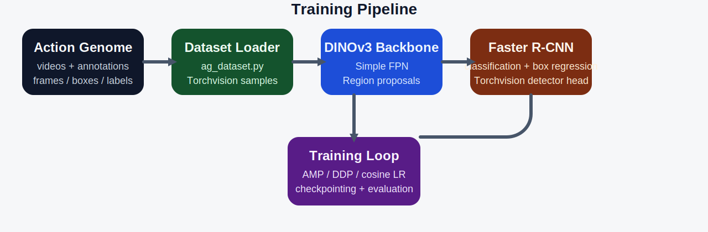

# Action Genome DINOv3 Detector


A research-oriented Faster R-CNN style object detector built with DINOv3 visual backbones for the Action Genome dataset.

This repository is designed for downstream Scene Graph Generation (SGG), Spatio-Temporal Scene Graph Generation (STSGG), Scene Graph Anticipation (SGA) and video scene understanding pipelines. It provides training, evaluation, feature extraction, and distributed training utilities for building high-quality object detectors on Action Genome.

## Use Cases

This repository can be used for:

- Scene Graph Generation (SGG)
- Spatio-Temporal Scene Graph Generation (STSGG)
- Scene Graph Anticipation (SGA)
- Object feature extraction
- Video understanding research

## Training pipeline



## Directory layout

```text
DINOv3-ActionGenome-Detector/
├── ag_dataset.py                # Action Genome dataset loader
├── detector_eval.py             # mAP evaluation helpers
├── dinov3_fasterrcnn.py         # DINOv3 + FPN + Faster R-CNN model builder
├── train.py                     # training entrypoint
├── __init__.py                  # package exports
└── checkpoints/                 # local checkpoint output directory
```

## What is included

- Action Genome dataset wrapper that returns Torchvision-style detection samples
- DINOv3 backbone adapter with a simple feature pyramid
- Torchvision Faster R-CNN model builder
- Training loop with AMP, DDP support, checkpointing, and optional Weights & Biases logging
- Lightweight mAP evaluation utilities

## Quick start

Install the dependencies in your environment:

```bash
pip install torch torchvision --index-url https://download.pytorch.org/whl/cu124
pip install -r requirements.txt
```

## Training

Single-GPU training:

```bash
python train.py \
  --data_path /path/to/action_genome \
  --output_dir ./checkpoints \
  --epochs 12 \
  --batch_size 2 \
  --num_workers 4 \
  --use_amp
```

Multi-GPU training with PyTorch DDP:

```bash
torchrun --nproc_per_node=4 train.py \
  --data_path /path/to/action_genome \
  --output_dir ./checkpoints \
  --distributed
```

Resume from a checkpoint:

```bash
python train.py \
  --data_path /path/to/action_genome \
  --output_dir ./checkpoints \
  --resume ./checkpoints/checkpoint_epoch_012.pth
```

Useful options:

- `--backbone_name` selects the Hugging Face DINOv3 checkpoint.
- `--freeze_backbone` freezes the pretrained backbone during training.
- `--data_fraction` and `--eval_fraction` let you run smaller debugging jobs.
- `--use_wandb` enables Weights & Biases logging.
- `--min_size` and `--max_size` control the detector resize policy.

## Dataset preparation

Expected Action Genome root layout:

```text
action_genome/
├── annotations/
├── frames/
└── videos/
```

Preparation steps:

1. Download the Charades videos and place them under `data/ag/videos`.
   Source: https://prior.allenai.org/projects/charades
2. Download the Action Genome annotations and place them under `data/ag/annotations`.
   Source: https://drive.google.com/drive/folders/1LGGPK_QgGbh9gH9SDFv_9LIhBliZbZys?usp=sharing
3. Dump the video frames into `data/ag/frames`.
4. Update the relevant file paths in `datasets/action_genome/tools/dump_frames.py` before running the frame extraction script.
5. Download `object_bbox_and_relationship_filtersmall.pkl` and place it in the data loader folder if you are using loaders that expect the filtered annotation file.
   Source: https://drive.google.com/file/d/19BkAwjCw5ByyGyZjFo174Oc3Ud56fkaT/view

Example frame-dumping command:

```bash
python tools/dump_frames.py
```

This detector itself uses the standard Action Genome annotation files from `annotations/`. The extra `object_bbox_and_relationship_filtersmall.pkl` file is mainly useful for compatibility with related pipelines that train or evaluate with the filtered small-box annotation variant.

## Checkpoints

| Checkpoint | Backbone | Dataset | mAP@0.50 | mAP@[0.50:0.95] |
| --- | --- | --- | ---: | ---: |
| `checkpoint_final.pth` | DINOv3 + Faster R-CNN | Action Genome | 37.5 | 18.5 |

Pretrained checkpoint download:

- Google Drive: `CHECKPOINT WILL BE ADDED SOON`

## Notes
- The default training output directory is `./checkpoints/`.
